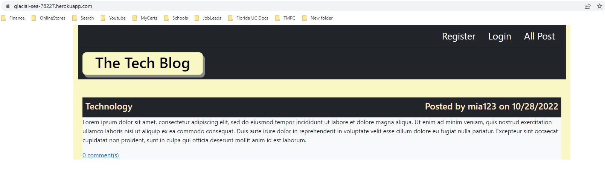
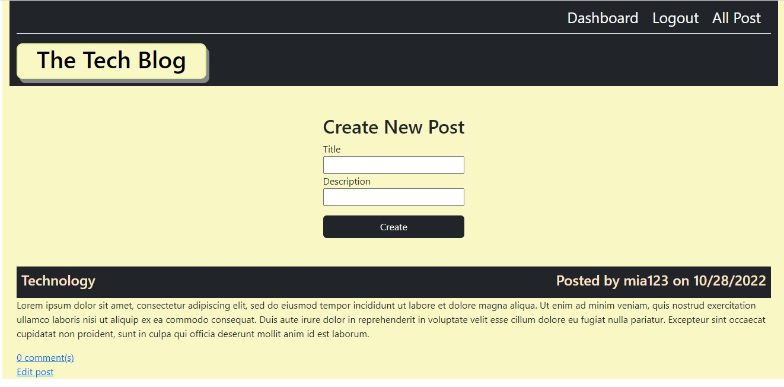

# MVC Tech-Blog

 # Badges: 
  

  # GitHub username: moniquemeas
    
  # Table of Contents
  * [Description](#description)
  * [Installation](#installation)
  * [Technology](#technoloy)
  * [Contributing](#contributing)
  * [License](#license)
  * [Contact](#contact)

  # Description:
  This application is a CMS-style blog, that allows developers to read and write blog about technical concept. 
  After users signup to the application, they are able to post and comment on other post.
  Users are able to update and delete posts.

  

  

  # Installation
  - Clone the repository from Github.
  - Install Node.js
  - npm init 
  - npm install

  # Technology:

  * JavaScript
  * Node.js
  * express.js
  * Handlebars
  * Sequeilize

  # Deployment Link:

    https://glacial-sea-78227.herokuapp.com/
  
 
  
  # Contributing:
  Monique Meas
    
  # License:
  * MIT
  * To find out more about MIT go to:
  * https://opensource.org/licenses/MIT
    
  # Contact:
  monique.meas@gmail.com
